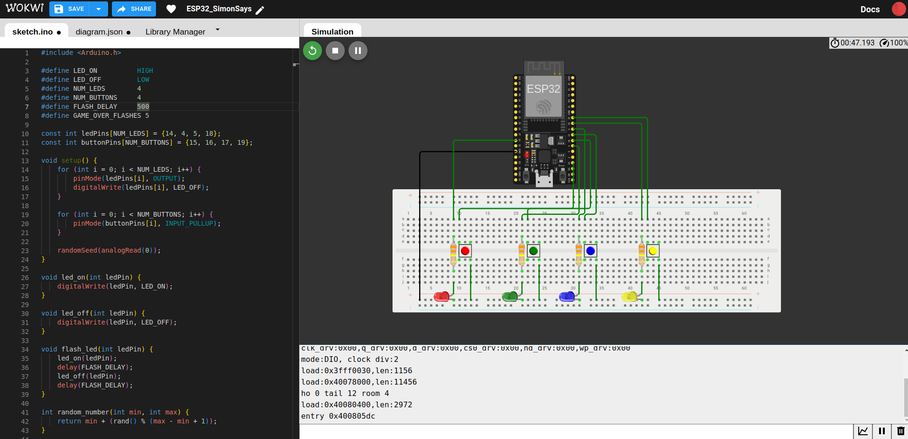
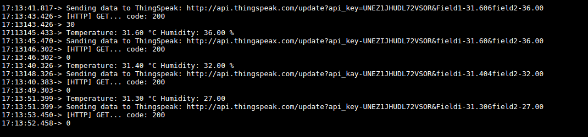
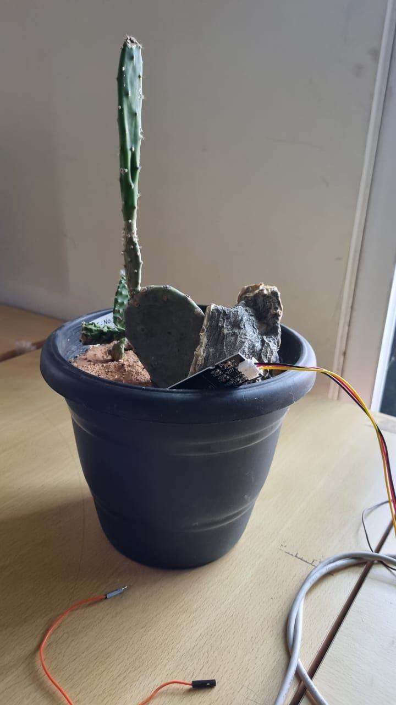
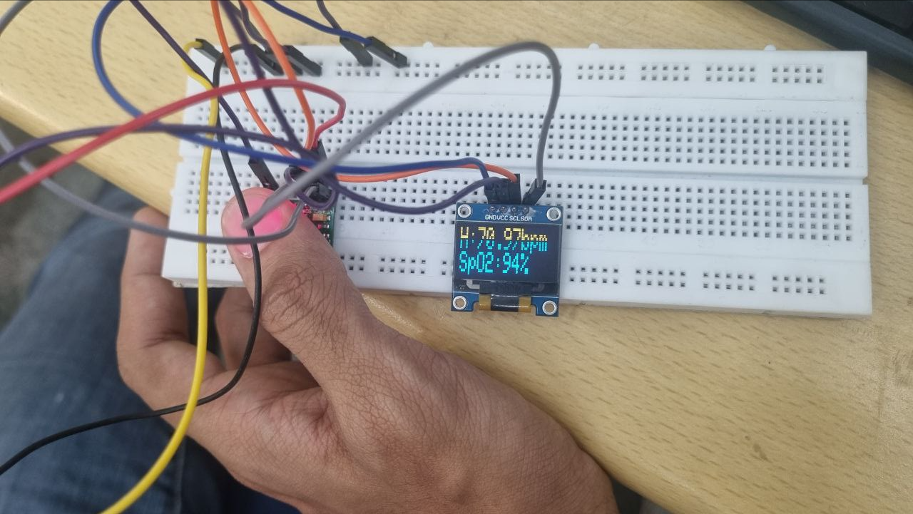

# Task 1 : Simon Says
-------------------------------------------
## What is Simon says game?

Simon says is a classic memory game where players should replicate a random sequence of colours provided by the device.

#### How was it implemented and what were the components used?
I used an **ESP 32**, LEDs and push buttons to realise the project. 

Here are the photos, videos, and links for a visual representation.

##### Simulation:

#
##### Circuit:

#
##### Video

#
#### Here is the [Link](https://wokwi.com/projects/393452127179111425) for the wokwi simulation. 
#### Here is the [Link](https://wokwi.com/projects/393452127179111425) for the source code. 

**Experience:** The coding part was not a that much of a hassle but implementing the game logic took a while. Connections were not that confusing but the main issue was I found it hard to upload code to ESP32, 1 in 3 attempts would be successful. 

# Task 2 : Basics of MQTT protocol
-------------------------------------------

**MQTT** (Message Queuing Telemetry Transport) is a lightweight messaging protocol commonly used in IoT applications. It operates on a **publish-subscribe model**, where devices publish messages to topics, and other devices subscribe to topics to receive messages. MQTT supports different quality of service levels for message delivery reliability. It uses a **lightweight** TCP connection for communication and includes features like **retained messages, last will and testament, and security mechanisms** for secure communication. Overall, MQTT is **efficient, scalable, and ideal** for IoT devices communicating over constrained networks.

Some other communication protocols are:
- HTTP
- I2C
- AMQP (Advanced Message Queing Protocol)
- Bluetooth, Cellular, WiFi and LAN.

# Task 3 : Basics of Creating a website.
-------------------------------------------
The task was to create a webpage which toggles background colour based on clicking a button. It uses basic HTML, CSS and Javascript.
##### Simulation:

#### Here is the [Link](https://github.com/Sunil-Hegde/marvelReport1/blob/main/level1/button.html) for the source code.

# Task 4 - ESP32 Cam
-------------------------------------------

The ESP32-CAM is a popular development board based on the ESP32 chip, which integrates both Wi-Fi and Bluetooth connectivity along with a camera module.

ESP32 CAM has no onboard data connection port so we had to use FTDI programmer to upload code. 

Here are the photos, videos, and links for a visual representation.

##### Circuit Diagram:

#
    Important:
        Jumper cable connecting IO0 and GND pin must be disconnected once the code is uploaded to the module.
##### Circuit:

#
##### Video

#
**Experience:** I did this task using my computer and it was bit of work to install Arduino IDE and setting it up but after that everything worked smoothly. 

# Task 6 - Sending data to ThingSpeak
-------------------------------------------

ThingSpeak is a Ruby-based open-source software that enables users to interact with internet-connected devices like ESP32. It simplifies the process of accessing, retrieving, and logging data by offering APIs for both devices and social networking platforms.

We were tasked to collect temperature data from DHT11 sensor and send it to ThingSpeak for visualisation using ESP32.

##### Serial monitor:

As we can see in the serial monitor, ESP32 collects data from DHT11 sensor and using ThinSpeak API sends the data to the website using HTTP request. HTTP request code 200 tells us that the connection was successful and the data was transmitted successfully.
#
##### Video:

#
##### Data visualisation in ThingSpeak website:

**Experience:** Once the ThingSpeak API was available, everything became easy. DHT11 sensor was not working and HTTP request was failing in the beginning. Everything started working properly after I replaced the sensor and checked all the connections and corrected them.

# Task 7 - Communication using I2C protocol
-------------------------------------------
The **I2C** (Inter-Integrated Circuit) protocol is a synchronous, multi-master, multi-slave, packet-switched serial communication protocol used for connecting multiple integrated circuits on a circuit board. It facilitates communication between various digital devices, such as microcontrollers, sensors, and peripheral ICs.

The task was establish connection between ESP32 and Arduino board, send message between them using I2C protocol and display the message on the serial monitor. 
#
##### Video:

#
##### Serial Monitor:

**Experience:** It was difficult to understand how it works but after a few trials it worked and the message was successfully displayed on the serial monitor.

# Task 8 - Flashing Morse Code
-------------------------------------------
We were tasked to create More Code flasher using ESP32. We were able to implement it without web server and by using the serial monitor.

Major problems we placed were uploading the code and trying to make the code run. This simple implimentation flashes the message given to the device using serial monitor.

#
##### Video:

It flashed the message "hello marvel".

# Task 9 - Soil Moisture Sensor
-------------------------------------------

We were tasked to display the soil moisture level in the serial monitor using a capacitive soil moisture sensor and an ESP32. It alerts the user if soil moisture level is below a particular level.

Capacitive soil moisture sensor works by checking the charge storing capacity of the soil which in turn indicates the amount of moisture present in the soil.

#
##### Serial Monitor:

#
##### Plant and sensor:

# Task 10 - Read and Display Vitals
-------------------------------------------
We were tasked to measure SPO2 levels and Heart rate using ESP32 and MAX30100 sensor and display them on an OLED display.

**MAX30100** is a pulse oximeter and heart rate sensor which uses photo diodes and receptors to determine the level of blood ogygen level and heart rate per minute. But how does that work? Follow [this](https://www.youtube.com/watch?v=BFZxlauizx0) link to understand how a simplest type of camera can be used to determine body vitals.

##### Vitals:

